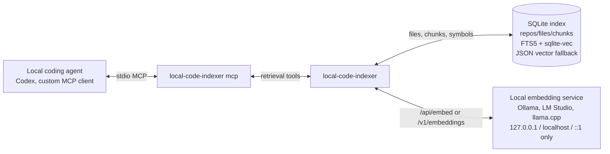
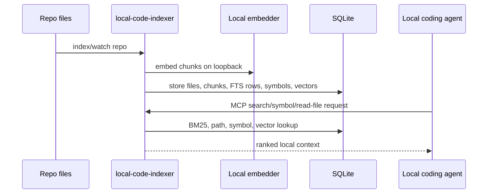

# local-code-indexer

Frontier hosted coding agents already have agentic grep/search and large context windows; local
coding models usually do not. `local-code-indexer` is the retrieval layer for those local models:
it indexes a repository into SQLite, searches it with FTS5 plus local vector retrieval, and exposes
the results through MCP so a local coding agent can ask for the right code before it answers. Code,
index data, and embeddings stay on the machine; embedding URLs are deliberately restricted to
loopback hosts only.

## Architecture





## Installation

Install the CLI package with pip; Python 3.11 or newer is required.

```bash
pip install local-code-indexer
```

## Local-model quickstart

1. Start a local embedding service. Ollama is the default backend:

   ```bash
   # In one terminal, if Ollama is not already running:
   ollama serve

   # In another terminal:
   ollama pull nomic-embed-text
   ```

   LM Studio or `llama.cpp`'s `llama-server` also work when they expose an OpenAI-compatible
   `/v1/embeddings` endpoint on loopback:

   ```bash
   export LOCAL_CODE_INDEXER_EMBED_API=openai
   export LOCAL_CODE_INDEXER_EMBED_URL=http://127.0.0.1:1234
   export LOCAL_CODE_INDEXER_EMBED_MODEL=nomic-embed-text
   ```

2. Initialize and index a repository:

   ```bash
   local-code-indexer init
   local-code-indexer index /path/to/repo
   local-code-indexer status
   ```

   The default repo name is the indexed directory's basename. Use `--name` when two repos would
   otherwise share the same basename:

   ```bash
   local-code-indexer index /path/to/repo --name my-repo
   ```

3. Register the MCP server with a local coding agent. For Codex:

   ```bash
   local-code-indexer mcp-config --client codex
   ```

   For Claude-style MCP config:

   ```bash
   local-code-indexer mcp-config --client claude
   ```

   The config snippet registers `local-code-indexer mcp` as the stdio server. Custom MCP clients can
   use the same command directly:

   ```bash
   local-code-indexer mcp
   ```

4. Query the index from the CLI while you are validating setup:

   ```bash
   local-code-indexer search "IndexService" --repo local-code-indexer --mode hybrid
   local-code-indexer symbols IndexService --repo local-code-indexer --kind class
   local-code-indexer read-file local-code-indexer src/local_code_indexer/service.py --start-line 1 --end-line 80
   ```

## CLI reference

```bash
local-code-indexer --version
local-code-indexer init
local-code-indexer index <repo_path> [--name NAME]
local-code-indexer watch <repo_path> [--name NAME] [--interval SECONDS]
local-code-indexer search <query> [--repo NAME] [--limit N] [--mode hybrid|lexical|vector] [--path GLOB] [--lang LANG] [--kind KIND]
local-code-indexer symbols [query] [--repo NAME] [--path PATH] [--limit N] [--lang LANG] [--kind KIND]
local-code-indexer list-files [--repo NAME] [--glob GLOB] [--limit N] [--lang LANG]
local-code-indexer read-file <repo> <path> [--start-line N] [--end-line N]
local-code-indexer status [--repo NAME]
local-code-indexer list-repos
local-code-indexer reindex-all
local-code-indexer remove <name>
local-code-indexer mcp-config --client claude|codex [--db-path DB_PATH]
local-code-indexer mcp
```

`local-code-indexer --version` prints the installed package version. CLI commands default to compact
human-readable output. Pass `--json` to any subcommand, such as
`local-code-indexer search token --json` or `local-code-indexer index . --json`, to print the
machine-readable JSON payload. `mcp-config` is the exception: it always prints a JSON client config
snippet meant to be pasted into a Claude or Codex MCP configuration.

`index` and `watch` require an existing directory. `watch` polls and re-indexes on an interval; a
failed pass logs to stderr and keeps polling. Repos are identified by resolved directory path. The
default name is the directory basename; indexing a second directory whose basename collides with an
existing repo fails with an error asking for an explicit `--name`. Re-indexing the same directory
with a new `--name` renames the repo in place. `remove <name>` deletes a repo and all of its indexed
data. `reindex-all` refreshes every registered repo and skips stored paths that no longer exist.

Read-side commands mirror the MCP retrieval tools: `search` returns ranked chunks; `symbols`
searches indexed symbols by repo, symbol text, path, language, and kind; `list-files` lists indexed
files by repo, glob, and language; `read-file` reads an indexed repo-relative file or line range.
When the index is empty, empty read-side output points to
`local-code-indexer index <repo_path>`; `status --repo` and `remove <name>` also error with the
indexed-repos list for unknown repos. Human output notes when an empty `--lang` or `--kind` filter
matches no indexed values; JSON output remains unchanged. For `search --mode vector`, empty human
output also notes when vector search could not run and suggests `--mode lexical` or re-indexing with
embeddings available. Search results whose only signal is a weak vector match are flagged
`low_confidence: true`; human output marks each flagged result and adds a trailing note when every
result is flagged, so a query with no good match in the index is not mistaken for real hits.

## MCP tools

The MCP server exposes read-side retrieval and status tools for local agents:

- `code_index_search(query, repo?, mode?, limit?, path?, lang?, kind?)`
- `code_index_list_files(repo?, glob?, limit?, lang?)`
- `code_index_list_repos()`
- `code_index_read_file(repo, path, start_line?, end_line?)`
- `code_index_symbols(repo?, query?, path?, limit?, lang?, kind?)`
- `code_index_status(repo?)`

Print client config snippets without editing live MCP config:

```bash
local-code-indexer mcp-config --client codex
local-code-indexer mcp-config --client claude
local-code-indexer mcp-config --client codex --db-path /path/to/index.db
```

## Retrieval mechanics

Search blends BM25/FTS5 lexical matching, local vector similarity when embeddings are present, path
matches, and symbol matches. Results include repo, path, line range, score reason, chunk id, file
hash, symbols, and snippet text.

Vector nearest-neighbor retrieval always returns something, even for queries that match nothing
indexed. Each result therefore carries a `vector_similarity` cosine value (`null` when the vector
signal did not contribute) and a `low_confidence` boolean: `true` when the result's only signal is
a vector match whose cosine similarity falls below the confidence threshold (default `0.6`,
tunable via `LOCAL_CODE_INDEXER_LOW_CONFIDENCE_SIMILARITY`). Consumers such as local coding models
should treat a response where every result is `low_confidence` as "no good match found".

Files are chunked by line windows that snap to tree-sitter definition boundaries: when a window
would cut a function or class in half, the chunk breaks before it so the next chunk starts at the
definition. Symbols come from the same tree-sitter parse, with a captured kind (`class`,
`function`, or `method`) and a regex fallback for languages the parser pack does not cover.

The indexer loads `sqlite-vec` when the Python package and SQLite extension are available, and
queries it with a proper vec0 KNN (`k = ?`) constraint. It also stores embedding JSON as a local
fallback so search remains usable if the extension cannot load. Changing the embedding backend,
model name, or dimension is handled on the next index run by rebuilding vectors.

## Indexing behavior

Indexing is incremental: files with an unchanged content hash are skipped when their existing
embeddings still match the current vector dimension and stored model/backend identity. The index run
reports `unchanged_files`, `skipped_files` (unreadable or non-UTF-8 files), `embedded_chunks`, and
`embedding_failures` so a dead embedding service is visible rather than silent. If five consecutive
embedding batches fail during one run, a circuit breaker stops calling the embedder for the
remainder of that run; remaining files are still indexed for lexical/path/symbol search with empty
embeddings, breaker-skipped chunks are not counted as `embedding_failures`, and the result includes
`degraded: true`.

## Configuration

| Variable | Default | Purpose |
| --- | --- | --- |
| `LOCAL_CODE_INDEXER_DB_PATH` | `~/.local/share/local-code-indexer/index.db` | SQLite database path. |
| `LOCAL_CODE_INDEXER_EMBED_URL` | `http://127.0.0.1:11434` | Local embedding service base URL. |
| `LOCAL_CODE_INDEXER_EMBED_MODEL` | `nomic-embed-text` | Embedding model name. |
| `LOCAL_CODE_INDEXER_EMBED_API` | `ollama` | `ollama` or `openai` for OpenAI-compatible local servers. |
| `LOCAL_CODE_INDEXER_DISABLE_EMBEDDINGS` | unset | Set to `1`, `true`, `yes`, or `on` for lexical/path/symbol-only indexing and search. |
| `LOCAL_CODE_INDEXER_LOW_CONFIDENCE_SIMILARITY` | `0.6` | Cosine similarity below which a vector-only search result is flagged `low_confidence: true`. |

The embedding URL must point to a loopback host (`127.0.0.1`, `localhost`, or `::1`) regardless of
backend. That restriction is part of the fully local design: hosted embedding APIs are rejected
before an HTTP request is made.

With `LOCAL_CODE_INDEXER_EMBED_API=ollama`, the indexer calls Ollama's `/api/embed`. With
`LOCAL_CODE_INDEXER_EMBED_API=openai`, it calls `/v1/embeddings`, which supports local
OpenAI-compatible servers such as LM Studio or `llama.cpp`'s `llama-server`.

`status` reports `degraded: true` when embeddings are enabled but stored coverage is incomplete
(`embedded_chunks < chunks`); disabled embeddings always report `degraded: false`. It keeps the
backward-compatible `sqlite_vec` field for extension load state (`loaded` or `unavailable`) and
also reports `vector_query_backend`: `unavailable` when the extension is not loaded, `sqlite-vec`
when stored vectors can be queried through the vec0 KNN table, and `json-fallback` when the
extension loaded but the readable vec0 path is not usable so vector queries fall back to the local
JSON cosine scan.

## Ignore rules

`.gitignore`, `.augmentignore`, and `.indexignore` are honored at every directory level, with nested
patterns scoped to their directory using gitignore semantics. Hard-skipped regardless of ignore
files: symlinks, dependency/build/cache directories (`node_modules`, `.venv`, `dist`, `.cache`,
...), lockfiles (`uv.lock`, `package-lock.json`, ...), secret-shaped files (`.env`, `.env.*`,
`.envrc`, private-key names, `.netrc`, key/cert suffixes, ...), binaries, and files over 1 MB.

## License

MIT licensed. See [LICENSE](LICENSE).
